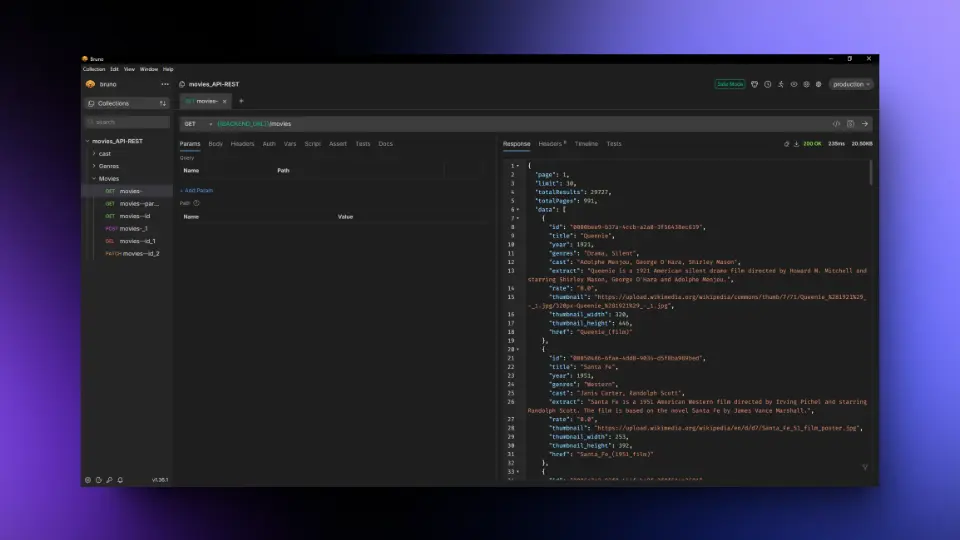

# Movies API

Una API RESTful para gestionar películas, géneros y actores. Este proyecto es ideal para aplicaciones que requieren organizar y acceder a grandes bases de datos de contenido multimedia. Permite operaciones CRUD y está diseñado para ser modular y escalable.

<p align="center">
  
</p>

## Tabla de Contenidos

- [Movies API](#movies-api)
  - [Tabla de Contenidos](#tabla-de-contenidos)
  - [Requisitos Previos](#requisitos-previos)
  - [Instalación](#instalación)
  - [Configuración](#configuración)
    - [.env](#env)
    - [.env.dev](#envdev)
  - [Uso](#uso)
  - [Rutas de la API](#rutas-de-la-api)
    - [Detalles de las Rutas](#detalles-de-las-rutas)
    - [I. Movies](#i-movies)
      - [Obtener todas las películas](#obtener-todas-las-películas)
      - [Buscar películas por parámetro](#buscar-películas-por-parámetro)
      - [Obtener detalles de una película por ID](#obtener-detalles-de-una-película-por-id)
      - [Crear una nueva película](#crear-una-nueva-película)
      - [Eliminar una película por ID](#eliminar-una-película-por-id)
      - [Actualizar una película por ID](#actualizar-una-película-por-id)
    - [II. Genres](#ii-genres)
      - [Obtener todos los géneros](#obtener-todos-los-géneros)
      - [Buscar géneros por parámetro](#buscar-géneros-por-parámetro)
      - [Obtener detalles de un género por ID](#obtener-detalles-de-un-género-por-id)
      - [Crear un nuevo género](#crear-un-nuevo-género)
      - [Eliminar un género por ID](#eliminar-un-género-por-id)
      - [Actualizar un género por ID](#actualizar-un-género-por-id)
    - [III. Cast](#iii-cast)
      - [Obtener todos los actores](#obtener-todos-los-actores)
      - [Buscar actores por parámetro](#buscar-actores-por-parámetro)
      - [Obtener detalles de un actor por ID](#obtener-detalles-de-un-actor-por-id)
      - [Crear un nuevo actor](#crear-un-nuevo-actor)
      - [Eliminar un actor por ID](#eliminar-un-actor-por-id)
      - [Actualizar un actor por ID](#actualizar-un-actor-por-id)
  - [Tecnologías Usadas](#tecnologías-usadas)
  - [Recursos](#recursos)
  - [Licencia](#licencia)

## Requisitos Previos

- Node.js v14+ instalado
- Docker y Docker Compose instalados
- MySQL Client (opcional, para gestionar la base de datos manualmente)

## Instalación

1. Clona este repositorio:
   ```bash
   git clone https://github.com/Severianh/movies_API-REST.git
   cd movies_API-REST
   ```
2. Instala las dependencias:
   
   ```bash
   npm install
   ```

---
## Configuración

1. Crea 2 archivos `.env` y `.env.dev` en la raÍz del proyecto con las siguientes variables:

   ### .env
   ```bash
   MYSQL_HOST=localhost
   MYSQL_USER=movie_user
   MYSQL_PASSWORD=********
   MYSQL_DATABASE=movies_db
   MYSQL_ROOT_PASSWORD=******
   ```

   ### .env.dev
   ```bash
   MYSQL_HOST=localhost
   MYSQL_USER=movie_user_dev
   MYSQL_PASSWORD=********
   MYSQL_DATABASE=movies_db_dev
   MYSQL_ROOT_PASSWORD=1******
   ```	

2. Levanta el contenedor MySQL.

   ```bash
   docker-compose up
   ```
3. Configuración Manual de MySQL (opcional)
   
   Si no deseas usar Docker, puedes configurar MySQL manualmente con los siguientes comandos, puedes ver los archivos sql en la carpeta db_init:

   ```sql
   CREATE DATABASE movies_db;
   CREATE DATABASE movies_db_dev;
   CREATE USER 'movie_user'@'localhost' IDENTIFIED BY 'password';
   GRANT ALL PRIVILEGES ON movies_db.* TO 'movie_user'@'localhost';
   GRANT ALL PRIVILEGES ON movies_db_dev.* TO 'movie_user'@'localhost';
   FLUSH PRIVILEGES;
   ```
---

## Uso

1. Para iniciar el servidor de desarrollo:
   ```bash
   npm run dev
   ```
2. Para iniciar el servidor de producción:
   ```bash
   npm run start
   ```

---
## Rutas de la API

| **Entidad** | **Método** | **Endpoint**  | **Descripción**                                      |
| ----------- | ---------- | ------------- | ---------------------------------------------------- |
| Movies      | GET        | `/movies`     | Listar todas las películas (con filtros opcionales). |
| Movies      | GET        | `/movies/:id` | Obtener detalles de una película por ID.             |
| Movies      | POST       | `/movies`     | Crear una nueva película.                            |
| Movies      | DELETE     | `/movies/:id` | Eliminar una película por ID.                        |
| Movies      | PATCH      | `/movies/:id` | Actualizar una película por ID.                      |
| Genres      | GET        | `/genres`     | Listar todos los géneros (con filtros opcionales).   |
| Genres      | GET        | `/genres/:id` | Obtener detalles de un género por ID.                |
| Genres      | POST       | `/genres`     | Crear un nuevo género.                               |
| Genres      | DELETE     | `/genres/:id` | Eliminar un género por ID.                           |
| Genres      | PATCH      | `/genres/:id` | Actualizar un género por ID.                         |
| Cast        | GET        | `/cast`       | Listar todos los actores (con filtros opcionales).   |
| Cast        | GET        | `/cast/:id`   | Obtener detalles de un actor por ID.                 |
| Cast        | POST       | `/cast`       | Crear un nuevo actor.                                |
| Cast        | DELETE     | `/cast/:id`   | Eliminar un actor por ID.                            |
| Cast        | PATCH      | `/cast/:id`   | Actualizar un actor por ID.                          |


### Detalles de las Rutas

En caso de usar Bruno, puedes usar la carpeta `/docs/api-collections` para ver las rutas de la API.
### I. Movies

#### Obtener todas las películas

- **Endpoint:** `GET /movies`
- **Descripción:** Retorna una lista de todas las películas disponibles.
- **Ejemplo de uso:**
  ```bash
  curl -X GET http://localhost:1234/movies
  ```

#### Buscar películas por parámetro

- **Endpoint:** `GET /movies?title=Brown`
- **Descripción:** Busca películas filtradas por parámetros como el título.
- **Ejemplo de uso:**
  ```bash
  curl -X GET "http://localhost:1234/movies?title=Brown"
  ```

#### Obtener detalles de una película por ID

- **Endpoint:** `GET /movies/:id`
- **Descripción:** Retorna la información detallada de una película específica.
- **Ejemplo de uso:**
  ```bash
  curl -X GET http://localhost:1234/movies/2cb64b73-b1f2-11ef-8bda-0242ac120002
  ```

#### Crear una nueva película

- **Endpoint:** `POST /movies`
- **Descripción:** Agrega una nueva película al sistema.
- **Headers:**
  - `Content-Type: application/json`
- **Body:**
  ```json
  {
    "title": "Quantum Horizon 3",
    "year": 2024,
    "cast": ["Adam Sevani", "Bruce Lanoil"],
    "genres": ["Science Fiction", "Thriller", "Adventure"],
    "href": "Quantum_Horizon",
    "extract": "Descripción aquí...",
    "thumbnail": "URL de la imagen",
    "thumbnail_width": 450.0,
    "thumbnail_height": 600.0
  }
  ```
- **Ejemplo de uso:**
  ```bash
  curl -X POST http://localhost:1234/movies \
       -H "Content-Type: application/json" \
       -d '{"title":"Quantum Horizon 3", ... }'
  ```

#### Eliminar una película por ID

- **Endpoint:** `DELETE /movies/:id`
- **Descripción:** Elimina una película específica del sistema.
- **Ejemplo de uso:**
  ```bash
  curl -X DELETE http://localhost:1234/movies/50d8a1e9-b413-11ef-8d31-0242ac120002
  ```

#### Actualizar una película por ID

- **Endpoint:** `PATCH /movies/:id`
- **Descripción:** Actualiza la información de una película específica.
- **Headers:**
  - `Content-Type: application/json`
- **Body:**
  ```json
  {
    "cast": ["Adam Sevani", "Bruce Lanoil", "Frank Powell"]
  }
  ```
- **Ejemplo de uso:**
  ```bash
  curl -X PATCH http://localhost:1234/movies/2cb64b73-b1f2-11ef-8bda-0242ac120002 \
       -H "Content-Type: application/json" \
       -d '{"cast": ["Adam Sevani", "Bruce Lanoil", "Frank Powell"]}'
  ```

### II. Genres

#### Obtener todos los géneros

- **Endpoint:** `GET /genres`
- **Descripción:** Retorna una lista de todos los géneros.
- **Ejemplo de uso:**
  ```bash
  curl -X GET http://localhost:1234/genres
  ```

#### Buscar géneros por parámetro

- **Endpoint:** `GET /genres?name=fiction`
- **Descripción:** Busca géneros por nombre.
- **Ejemplo de uso:**
  ```bash
  curl -X GET "http://localhost:1234/genres?name=fiction"
  ```

#### Obtener detalles de un género por ID

- **Endpoint:** `GET /genres/:id`
- **Descripción:** Retorna la información detallada de un género específico.
- **Ejemplo de uso:**
  ```bash
  curl -X GET http://localhost:1234/genres/179
  ```

#### Crear un nuevo género

- **Endpoint:** `POST /genres`
- **Descripción:** Agrega un nuevo género al sistema.
- **Headers:**
  - `Content-Type: application/json`
- **Body:**
  ```json
  {
    "name": "Anime XZ"
  }
  ```
- **Ejemplo de uso:**
  ```bash
  curl -X POST http://localhost:1234/genres \
       -H "Content-Type: application/json" \
       -d '{"name":"Anime XZ"}'
  ```

#### Eliminar un género por ID

- **Endpoint:** `DELETE /genres/:id`
- **Descripción:** Elimina un género específico del sistema.
- **Ejemplo de uso:**
  ```bash
  curl -X DELETE http://localhost:1234/genres/232
  ```

#### Actualizar un género por ID

- **Endpoint:** `PATCH /genres/:id`
- **Descripción:** Actualiza la información de un género específico.
- **Headers:**
  - `Content-Type: application/json`
- **Body:**
  ```json
  {
    "name": "Anime"
  }
  ```
- **Ejemplo de uso:**
  ```bash
  curl -X PATCH http://localhost:1234/genres/231 \
       -H "Content-Type: application/json" \
       -d '{"name":"Anime"}'
  ```

### III. Cast

#### Obtener todos los actores

- **Endpoint:** `GET /cast`
- **Descripción:** Retorna una lista de todos los actores.
- **Ejemplo de uso:**
  ```bash
  curl -X GET http://localhost:1234/cast
  ```

#### Buscar actores por parámetro

- **Endpoint:** `GET /cast?name=Will`
- **Descripción:** Busca actores por nombre.
- **Ejemplo de uso:**
  ```bash
  curl -X GET "http://localhost:1234/cast?name=Will"
  ```

#### Obtener detalles de un actor por ID

- **Endpoint:** `GET /cast/:id`
- **Descripción:** Retorna la información detallada de un actor específico.
- **Ejemplo de uso:**
  ```bash
  curl -X GET http://localhost:1234/cast/135855
  ```

#### Crear un nuevo actor

- **Endpoint:** `POST /cast`
- **Descripción:** Agrega un nuevo actor al sistema.
- **Headers:**
  - `Content-Type: application/json`
- **Body:**
  ```json
  {
    "name": "Will Torne IV"
  }
  ```
- **Ejemplo de uso:**
  ```bash
  curl -X POST http://localhost:1234/cast \
       -H "Content-Type: application/json" \
       -d '{"name":"Will Torne IV"}'
  ```

#### Eliminar un actor por ID

- **Endpoint:** `DELETE /cast/:id`
- **Descripción:** Elimina un actor específico del sistema.
- **Ejemplo de uso:**
  ```bash
  curl -X DELETE http://localhost:1234/cast/135854
  ```

#### Actualizar un actor por ID

- **Endpoint:** `PATCH /cast/:id`
- **Descripción:** Actualiza la información de un actor específico.
- **Headers:**
  - `Content-Type: application/json`
- **Body:**
  ```json
  {
    "name": "Will Torne III"
  }
  ```
- **Ejemplo de uso:**
  ```bash
  curl -X PATCH http://localhost:1234/cast/135855 \
       -H "Content-Type: application/json" \
       -d '{"name":"Will Torne III"}'
  ```

---
## Tecnologías Usadas

- Node.js
- Express
- MySQL
- Docker (para la base de datos)
- Jest/Supertest (para pruebas)


## Recursos

- [Documentación de Node.js](https://nodejs.org/)
- [Documentación de Docker](https://docs.docker.com/)
- [MySQL Reference Manual](https://dev.mysql.com/doc/)


## Licencia

Este proyecto está licenciado bajo la [Licencia MIT](LICENSE).


